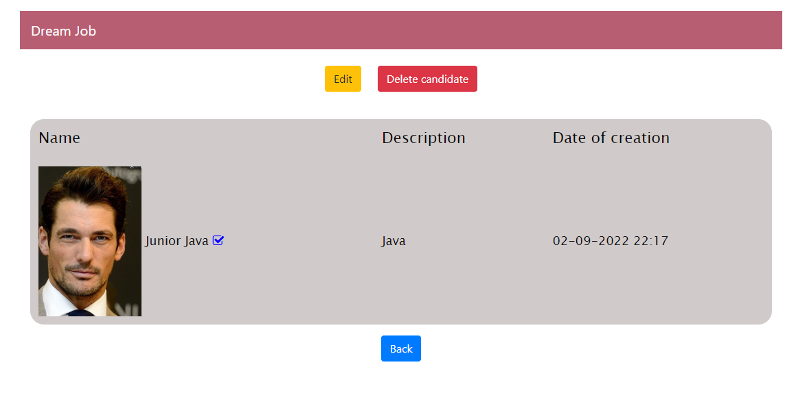
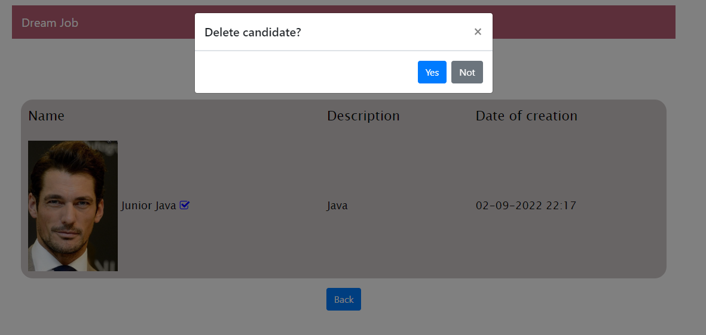

# Dream job

<a name="menu"></a>
<ul>
    <li>
        <a href="#about">О проекте</a>
        <ul>
            <li><a href="#description">Описание</a></li>
            <li><a href="#technologies">Технологии</a></li>
        </ul>
    </li>
    <li>
        <a href="#build">Сборка</a>
    </li>
    <li>
        <a href="#usage">Использование</a>
        <ul>
            <li><a href="#registration">Страница регистрации</a></li>
            <li><a href="#singIn">Страница входа</a></li>
            <li><a href="#hall">Главная страница</a></li>
            <li><a href="#listPost">Список вакансий</a></li>
            <li><a href="#addPost">Добавление вакансии</a></li>
            <li><a href="#postDescription">Описание вакансии</a></li>
            <li><a href="#deletePost">Удаление вакансии</a></li>
            <li><a href="#editPost">Редактирование вакансии</a></li>
            <li><a href="#listCandidate">Список кандидатов</a></li>
            <li><a href="#addCandidate">Добавление резюме</a></li>
            <li><a href="#candidateDescription">Описание резюме</a></li>
            <li><a href="#deleteCandidate">Удаление резюме</a></li>
            <li><a href="#editCandidate">Редактирование резюме</a></li>
        </ul>
    </li>
</ul>

<h2><a name="about">О проекте</a>&nbsp;&nbsp;<a href="#menu">&#9650;</a></h2>
<h4><a name="description">Описание</a>&nbsp;&nbsp;<a href="#menu">&#9650;</a></h4>
<p>
В системе будут два типа пользователей: кандидаты и кадровики.
Кандидаты будут публиковать резюме. Кадровики будут публиковать вакансии о работе.
Кандидаты могут откликнуться на вакансию. Кадровик может пригласить на вакансию кандидата.
</p>

<h4><a name="technologies">Технологии</a>&nbsp;&nbsp;<a href="#menu">&#9650;</a></h4>
<ul>
    <li>Java 17</li>
    <li>PostgreSQL, JDBC, Liquibase</li>
    <li>Mockito</li>
    <li>Maven</li>
    <li>Spring boot</li>
    <li>HTML, CSS, Bootstrap, Thymeleaf JavaScript</li>
</ul>

</code></pre>

<h2><a name="build">Сборка</a>&nbsp;&nbsp;<a href="#menu">&#9650;</a></h2>
<ol>
    <li>
        Для успешной сборки и работы проекта на вашем компьютере должны быть установлены:
        <ol>
            <li>JDK 17(+)</li>
            <li>Maven</li>
            <li>PostgreSQL</li>
        </ol>
    </li>
    <li>
        В PostgreSQL создайте базу с именем "dreamjob"
    </li>
    <li>
        Скачайте проект к себе на компьютер с помощью команды<br>
        <code>git clone git@github.com:ValeraDanilov/job4j_dreamjob.git</code><br>
        перейдите в корень проекта
    </li>
    <li>
        Добавьте настройки для доступа к базе данных, для этого внесите соответствующие изменения в файле 
        <code>src/main/resources/db.properties</code><br>
        и в файле конфигурации проекта <code>pom.xml</code>

``` 
<profile>   
    <id>production</id>
    <properties>
        <db.url>jdbc:postgresql://127.0.0.1:5432/dreamjob</db.url>
        <db.username>postgres</db.username>
        <db.password>password</db.password>
        <db.driver>org.postgresql.Driver</db.driver>
    </properties>
</profile>
```

</li>
    <li>
        Выполните команду <code>mvn install</code> в корне проекта для его сборки<br>
        Будет выполнена миграция БД с помощью Liquibase.<br>
    </li>
    <li>
        Команда для запуска из консоли <code>java -jar target/dreamjob-1.0.jar</code> после чего перейдите по данной ссылке.<br>
        <a href="http://localhost:8080/sessions/">http://localhost:8080/index</a>
    </li>
</ol>

<h2><a name="usage">Использование</a>&nbsp;&nbsp;<a href="#menu">&#9650;</a></h2>

<h3><a name="registration">Страница регистрации</a>&nbsp;&nbsp;<a href="#menu">&#9650;</a></h3>
<p>
    Страница регистрации. Без регистрации вы не сможете пользоваться данным ресурсом. Регистрация обязательная.
</p>
<p style="text-align: center">
  
</p>
<h3><a name="singIn">Страница входа</a>&nbsp;&nbsp;<a href="#menu">&#9650;</a></h3>
<p>
   Страница входа.
</p>
<p style="text-align: center">
  
</p>

<h3><a name="hall">Главная страница</a>&nbsp;&nbsp;<a href="#menu">&#9650;</a></h3>
<p>
   Главная страница. Тут отображаются вакансии и резюме. Создание за последние сутки.
</p>
<p style="text-align: center">
  
</p>
<h3><a name="listPost">Список вакансий</a>&nbsp;&nbsp;<a href="#menu">&#9650;</a></h3>
<p>
    Список всех доступных вакансий.
</p>
<p style="text-align: center">
  
</p>
<h3><a name="addPost">Добавление вакансии</a>&nbsp;&nbsp;<a href="#menu">&#9650;</a></h3>
<p>
   Окно для добавления новой вакансии.
</p>
<p style="text-align: center">
  
</p>
<h3><a name="postDescription">Описание вакансии</a>&nbsp;&nbsp;<a href="#menu">&#9650;</a></h3>
<p>
Нажав на определённую вакансию, можно увидеть подробную информацию о ней.
</p>
<p style="text-align: center">
  
</p>
<h3><a name="deletePost">Удаление вакансии</a>&nbsp;&nbsp;<a href="#menu">&#9650;</a></h3>
<p>
На странице Описание вакансии есть кнопка для её удаления.
</p>
<p style="text-align: center">
  
</p>
<h3><a name="editPost">Редактирование вакансии</a>&nbsp;&nbsp;<a href="#menu">&#9650;</a></h3>
<p>
На странице Описание вакансии есть кнопка для её редактирования.
<p style="text-align: center">
  
</p>
<h3><a name="listCandidate">Список кандидатов</a>&nbsp;&nbsp;<a href="#menu">&#9650;</a></h3>
<p>
Список всех доступных кандидатов.
</p>
<p style="text-align: center">
  
</p>
<h3><a name="addCandidate">Добавление резюме</a>&nbsp;&nbsp;<a href="#menu">&#9650;</a></h3>
<p>
   Окно для добавления резюме.
</p>
<p style="text-align: center">
  
</p>
<h3><a name="candidateDescription">Описание резюме</a>&nbsp;&nbsp;<a href="#menu">&#9650;</a></h3>
<p>
   Нажав на определённое резюме, можно увидеть подробную информацию о нём.
</p>
<p style="text-align: center">
  
</p>
<h3><a name="deleteCandidate">Удаление резюме</a>&nbsp;&nbsp;<a href="#menu">&#9650;</a></h3>
<p>
   На странице Описание резюме есть кнопка для её удаления.
</p>
<p style="text-align: center">
  
</p>
<h3><a name="editCandidate">Редактирование резюме</a>&nbsp;&nbsp;<a href="#menu">&#9650;</a></h3>
<p>
  Окно редактирования резюме.
</p>
<p style="text-align: center">
  
</p>
<p>
 Так же тут можно сменить или удалить свою Фото.
</p>
<p style="text-align: center">
  
</p>
